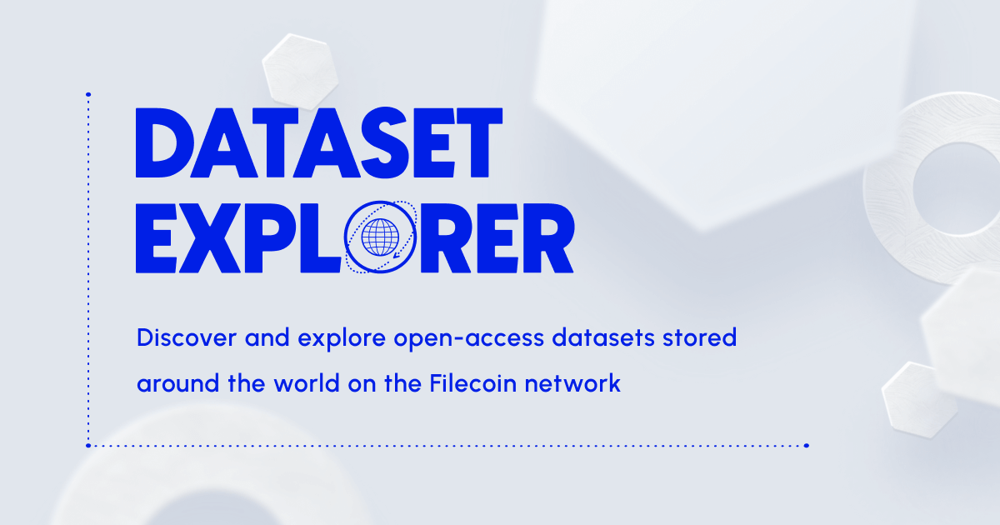

# Dataset Explorer
### [datasets.filecoin.io](https://datasets.filecoin.io)



## Overview

The Filecoin Dataset Explorer takes the datasets stored from initiatives like [Space Race 2: Slingshot](https://slingshot.filecoin.io) and other sources and presents them in a unified interface. This project is primarily interested in creating a unified interface for users to find where on the Filecoin network public and open-access datasets are stored.

## Architecture

- This site is built using Nuxt, a framework based on Vue.js
- It is not a static site and reads data coming in from another server side resource
- Currently data is populated from another repository, `slingshot-be`: this acts as a source of truth on deals
- Dataset metadata however, is stored in this repository

## Installation
Node 16 or higher and `npm` or `yarn` is required

### To install locally

- Clone this repo and navigate to its directory
- Install dependencies with `npm ci`
- Run locally with `npm run dev`

## Environment variables

Please include the following environment variables when running the site locally

```ini
NODE_ENV=development
SERVER_ENV=development
```
